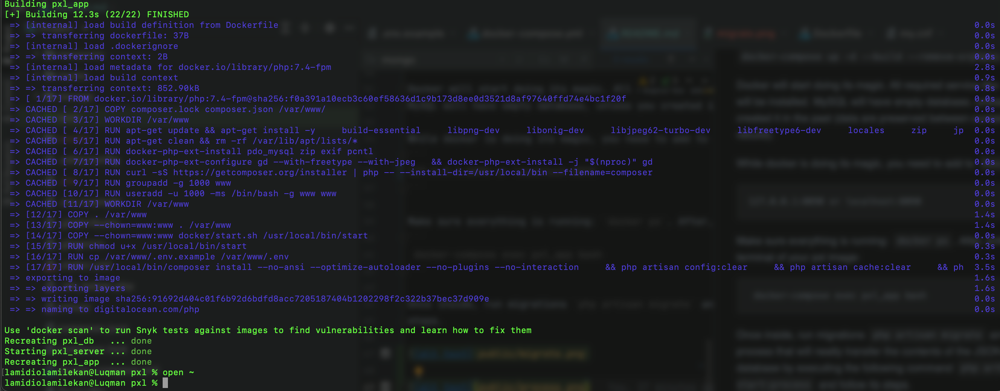
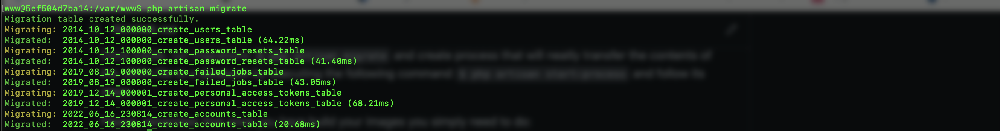
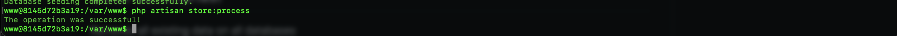

<p align="center"><a href="https://pxlwidgets.com" target="_blank"></a></p>

### PXL.Widgets

## The application should have the following:

Write a process that will neatly transfer the contents of the JSON file to a database.
Preferably as a background task in Laravel. Using Docker is allowed, but only if that makes its more fun.
We mainly pay attention to the design and structure of the code. We would prefer a solid, neat, well-maintainable solution that doesn’t work 100%, then a completed solution that is messy and inimitable. We are particularly interested in the thinking behind your approach.


## Conditions

-  [Primary] Create a process in such a way that it can be cut off at any moment (i.e. by a
SIGTERM, power failure, etc.), and can easily be resumed from the point where you left off, by anyone, in a robust & reliable manner (without duplicating data)1.
- Design your solution 'for growth', taking into account a hypothetical customer who will always have additional wishes.
- Use a solid, but not exaggerated database model.
Code for Eloquent models, relationships are not important here, we are more concerned about the data structure.
- Only process records of which the age is between 18 and 65 (or unknown).


## Bonus

Bonus
As an added challenge, we offer the following information:
- What if the source file suddenly becomes 500 times larger?
- Is the process easy to deploy for an XML or CSV file with similar content?
- Suppose that only records of which the credit card number contains three of the same numbers consecutively should be processed, how would you approach that?
- Please note that there is no guarantee that there are no duplicate records in the source file (there are no guaranteed unique (combinations of) properties) – and all duplicates must be copied in an exact manner into the database.

## Technologies

- PHP 7.4
- Laravel
- Docker

## How to run the application

Below are the steps you need to successfully setup and run the application.
- Clone the app from the repository and cd into the root directory of the app

```
 cp .env.example .env
```
Make sure docker is installed on your machine.

Now, the most important, build and start the docker containers.
` docker-compose up -d --build --remove-orphans`



Docker will start doing its magic. All required service like mysql, will be installed.
MySQL will have empty database, unless you created it in the past (data are preserved between containers rebuild).

While docker is doing its magic, you need to add to `hosts` file:
```
127.0.0.1:8090 or localhost:8090
```

Make sure everything is running: `docker ps`. After, enter the terminal of your pxl image:
```
 docker-compose exec pxl_app bash
```

Once inside, run migrations `php artisan migrate` and create process that will neatly transfer the contents of the JSON file to a database by executing the following command ` php artisan start:process` and follow its
steps.



&nbsp;
&nbsp;
&nbsp;

Please, remember that once you have build your images you simply need to do:
```
 docker-compose stop # to stop the images
 docker-compose start # to start the services again
```

To remove everything:
```
 docker-compose down --remove-orphans
```

### Other commands.

Store data from file(XML,JSON,CSV) to database
```
php artisan store:process
```
Removes all existing data on all databases
```
php artisan migrate:fresh 
```
